# BombLab

**姓名**：魏剑宇

**学号**：PB17111586

**代码地址**：[Github](https://github.com/kaleid-liner/CSAPP/tree/master/bomb)(在DDL之后我会将此仓库make public)

此实验并不复杂，因为出题者很友好地在二进制文件中附加了调试信息。由于我之前已对*System V AMD64 ABI*的Calling Convention有一定了解，分析中就相对比较轻松。

## Methods

对较简单的phase直接观察汇编就可得出答案。

对稍微复杂的代码，由于我的ida pro安装在windows上，而bomb二进制文件只能在*unix上运行，故使用ida pro + remote debugger进行远程调试。这样省下了不少力气。

**实验环境**：IDA Pro on Windows 10、 gdbserver on Ubuntu（虚拟机）

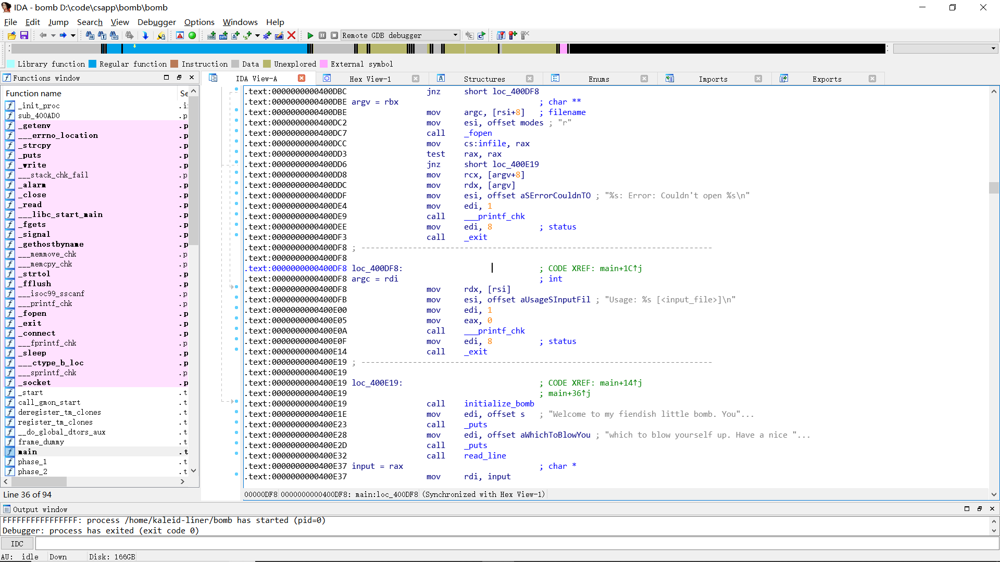


## Solutions

### phase1

phase1很简单。对phase1进行考察，发现唯一的检验是将用户的输入与一段硬编码的字符串进行对比。这样，只需要找到这段字符串即可。

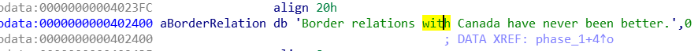

**答案是**：`Border relations with Canada have never been better.`

### phase2

phase2的检验分为几个阶段，它首先通过一个`read_six_numbers`的函数读入6个整数，如果未成功读取到6个，炸弹就爆炸了。

这一步分析的时候需要注意System V AMD64 ABI的Calling Convention。`read_six_numbers`中使用到了函数`sscanf`，且接受了8个参数。参数的传递方式为前6个依次通过RDI, RSI, RDX, RCX, R8, R9传入，其它参数从右向左的推入栈中。

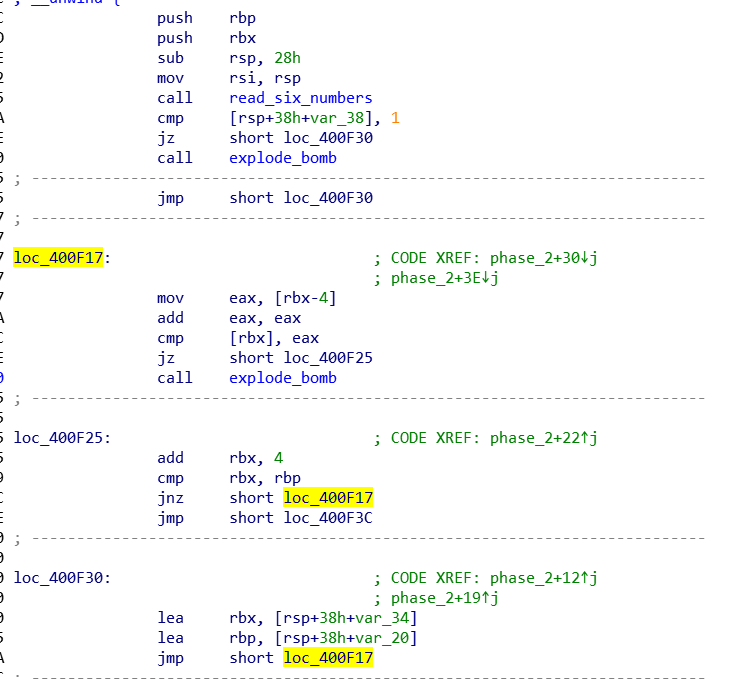

之后，便开始正式的检验。

首先，`[rsp+38h+var_38]`=`[rsp]`，是读入的第一个整数，将之和1比较，不相等就boom。

之后在一个循环中做的是依次比较前一个数和后一个数，后一个数应是前一个数的两倍。

**答案是**：`1 2 4 8 16 32`

### phase3

phase3观察一下，发现考察的内容是`switch`语句的jump table。它读入两个整数，第一个用于条件分支，得到一个数，放入`eax`中，再将条件分支得到的数与输入的第二个整数比较，若相同则成功。ida pro很容易的识别了这个switch的boilerplate，于是此题就更简单了。

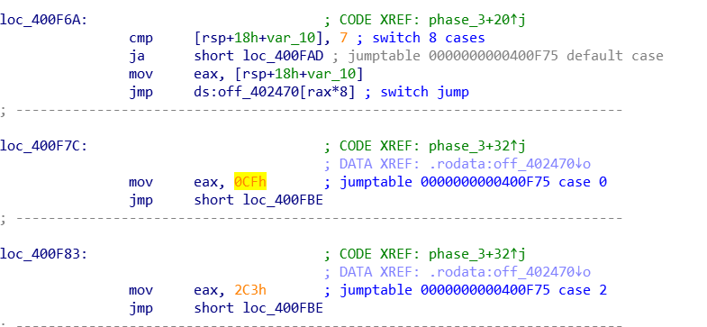

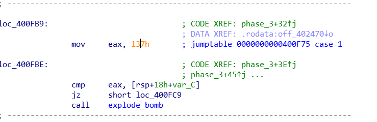

所以这题的答案有多种。

**答案**：`0/1/2/3/4/5/6/7 207/311/707/256/389/206/682/327 `

### phase4

phase4的大致流程是：

1. 读入两个数
2. 判断是否成功读入了两个数
3. 通过一个递归函数 `func4`判断两个数是否满足一定条件
4. 若`func4`返回0，则通过

事实上，func4的递归只是使这道题目看起来复杂一点，分析的时候发现不需要递归一次就可以让func4返回并通过测试。*此题也需要比较熟悉System V AMD64 ABI的参数传递*。

func4的接口是`func4(edi, esi, edx)`。在调用func4之前，读入了两个值，设为`input_1`、`input_2`，input_2需满足`input_2 == 0`，input_1需满足`input_1 << 0EH`。

初始调用func4使，调用的参数是`func4(input_1, 0, 0EH)`，如下所示。

```assembly
mov     edx, 0Eh
mov     esi, 0
mov     edi, [rsp+18h+var_10]
call    func4
```

以下是func4的主要内容

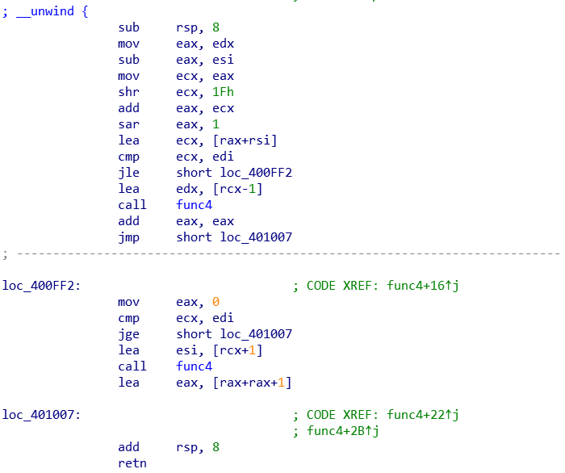

上面做的计算是（*设func4(a, b, c)*)，$ecx = b + [(c - b) >> ^{shr} 31 + (c - b)] >> ^{sar} 1$。

这里由于初始时b = 0，且c >> 31 = 0，故上式可以化简为$ecx = c \div 2$。之后，通过一个`jle`和`jge`，实际上就是判断a是否等于c。

**综上所述**，最后需要满足的条件就是input_1 / 2 == 14, 得input_1 == 7.

**答案**：`7 0`

### phase5

这题考察的应该是识别数组访问的模式。唯一的麻烦是代码中有一些不知是编译器生成的还是人为加入的冗余代码。首先读入一段字符串，需要经过的检验如下

1. 字符串长度为6
2. `new_string = [array[ch & 0xF] for ch in old_string]`.
3. `new_string == "flyers"`

而`array`是长这样的，

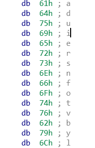

故只需要凑出这个字符串即可。

**答案**：`ionufg`

### phase6

phase6相对比较复杂。这一题的主要难点在出现了链表的数据结构。这个链表每个节点的结构为：

```c
struct node {
    long long data;
    struct node *next;
}
```

在内存中的链表共有六个节点。

如下为node1的内容

```assembly
.data:00000000006032D0                 public node1
.data:00000000006032D0 node1           db  4Ch ; L             ; DATA XREF: phase_6:loc_401183↑o
.data:00000000006032D0                                         ; phase_6+B0↑o
.data:00000000006032D0                                         ; linked list
.data:00000000006032D1                 db    1
.data:00000000006032D2                 db    0
.data:00000000006032D3                 db    0
.data:00000000006032D4                 db    1
.data:00000000006032D5                 db    0
.data:00000000006032D6                 db    0
.data:00000000006032D7                 db    0
.data:00000000006032D8                 db 0E0h
.data:00000000006032D9                 db  32h ; 2
.data:00000000006032DA                 db  60h ; `
.data:00000000006032DB                 db    0
.data:00000000006032DC                 db    0
.data:00000000006032DD                 db    0
.data:00000000006032DE                 db    0
.data:00000000006032DF                 db    0
```

再观察代码的结构，发现代码大致可以分为5个部分。

第一部分，代码读入6个整数。再判断这六个数是否小于等于6。值得一提的是，代码中判断是否小于等于6的部分如下：

```assembly
sub     eax, 1
cmp     eax, 5
jbe     short loc_401128
```

jbe是用于无符号整数的跳转，故实际上eax需满足$1 \le eax \le 6$.

第二部分对读入的数进行一些判断，其代码的结构如下。

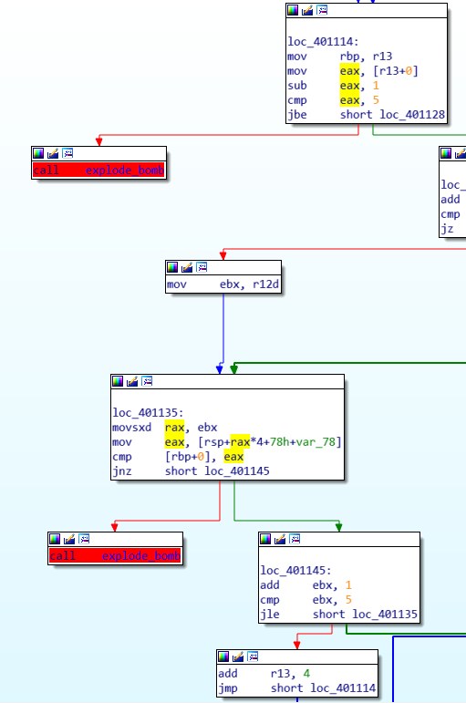

观察上面代码的结构，发现是一个典型的两层循环，根据jnz -> explose_bomb，容易判断这段的目的是检查六个数是否两两不等。这样，结合第一个部分的条件，可知读入的六个整数应该恰好是1、2、3、4、5、6这六个数。

第三部分，代码结构如下，

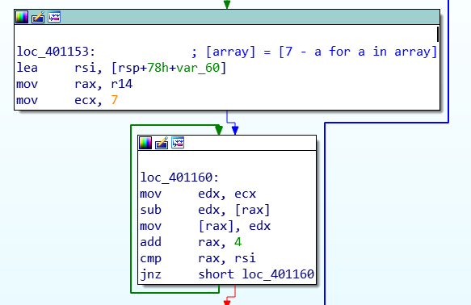

这一段做的事大概是，（设读入的六个数为input_array）

```python
input_array = [(7 - x) for x in input_array]
```

第四部分，在栈中建立一个指针数组，数组内依次存下与数字对应的节点指针。如若input_array中的数为3，则在指针数组中对应的位置存node3的地址。

第五部分，在第四步建立的指针数组中依次扫描，判断每个节点的data是否是单调递增。即：

````c
node_array[0]->data < node_array[1]->data;
// --snippet--
node_array[5]->data < node_array[6]->data;
````

由上，就得出了六个节点需满足的条件，再观察内存中这六个节点的data大小，即可知道答案如下。

**答案**：`4 3 2 1 6 5`

总之，先来个通关纪念

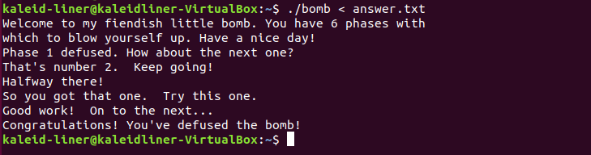

这样，这个实验就完成了......

但出题者告诉我们似乎没有那么简单，

>  /* Wow, they got it!  But isn't something... missing?  Perhaps something they overlooked?  Mua ha ha ha ha! */

**To Be Continued...**

## Secret phase

执行以下命令，发现了一些有意思的东西，

```shell
unix > strings bomb 
```

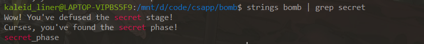

在ida pro中找到相关字符串，发现隐藏关卡藏在了`phase_defused`中。进一步观察隐藏关卡的触发条件，发现当读入6条字符串（即已经通过了前六关后），它会再一次用到phase4中读入的字符串。如下图所示，

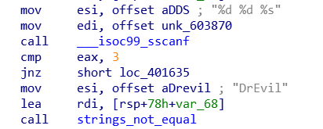

回忆一下，phase4是读入两个整数。若phase4中输入两个整数之外还输入一个字符串，并且该字符串和**暗号**一致，即进入了隐藏关卡。观察汇编，发现暗号是`DrEvil`。因此将phase4的答案修改为`7 0 DrEvil`。

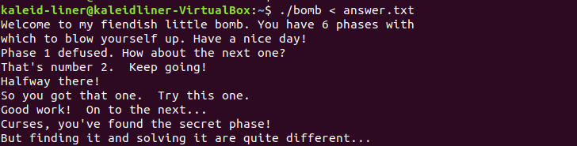

### How to Solve it

既然找到了隐藏关卡，接下来就是如何打通了。

首先此题读入了一个字符串，然后使用`strtol`将其转化为`long long`。需满足的第一个条件是`input_number - 1 <= 3E8`。第二个条件是`func7(&n1, input_number) == 2`。如下所示。

```assembly
mov     esi, ebx
mov     edi, offset n1
call    fun7
cmp     eax, 2
jz      short loc_401282
```

接下来仔细审核func7，其结构如下所示，是一个复杂的递归函数。

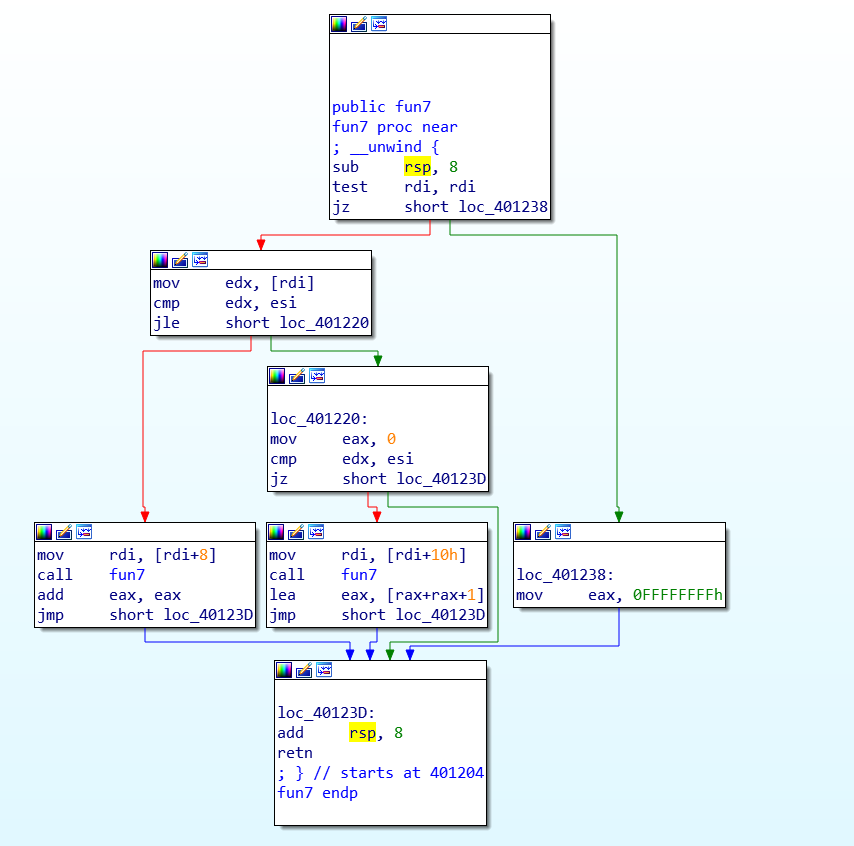

发现func7有三种返回的方式：

1. `rdi == nullptr`。显然不用考虑此种情况。
2. `[rdi] == input_number`。此时返回0.
3. `[rdi] < input_number`。此时返回2 * func7 + 1。
4. `[rdi] > input_number`。此时返回2 * func7。

发现，要凑出2，需要(0 * 2 + 1) * 2 = 2。则递归的过程如下：

1. `[n1] > input_number`。其中`[n1]`为0x24。
2. `[[n1 + 8]] < input_number`。其中`[[n1 + 8]]`为8。
3. `[[n1 + 8] + 16] == input_number`。其中[[n1 + 8] + 16]为22。

则只需要满足`input_number == 22`即可。Secret phase整体并不难，只不过要留意出题者的提示知道还有隐藏关卡 : )

**答案**：`22`

## Conclusion

故全部的答案为

```
Border relations with Canada have never been better.
1 2 4 8 16 32
0 207
7 0 DrEvil
ionufg
4 3 2 1 6 5
22
```

接下来留一张真正的通关纪念，

