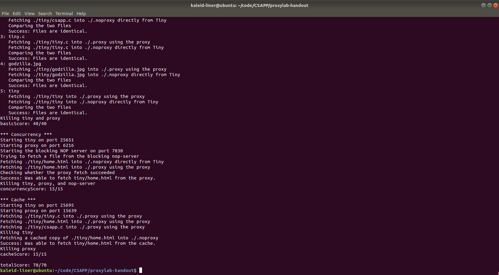

# ProxyLab

**姓名**：魏剑宇

**学号**：PB17111586

**代码地址**：[Github](https://github.com/kaleid-liner/CSAPP/)(在DDL之后我会将此仓库make public)

---

## Development Environment

- **OS**: VMWare Ubuntu 18.04
- **Editor**: VSCode
- **Compiler**: gcc (Ubuntu 7.3.0-27ubuntu1~18.04) 7.3.0
- **Debug**: VSCode + gdb
- **Version Control**: Git

## Code Structure

- `csapp.h`, `csapp.c`：由实验提供的一套 Robust io 库，和网络常用操作的 API

- `proxy.h`, `proxy.c`：http proxy 的核心代码

- `cache.h`, `cache.c`：定义了 cache 的数据结构及提供的一套接口，这个用于我的 proxy 的 cache 部分

- `hashmap.h`, `hashmap.c`：定义了 hashmap 数据结构及接口。这个用于 cache 的数据存储。

  关于 hashmap：在实现 proxy 的 caching 时，我考虑了 cache 的存储结构。cache 实际是一系列的 K-V 值，若使用线性表效率很低，最好的是使用查找树或哈希表实现。而由于此次实验的语言限制在C，C的标准库中未提供 hashmap 或类似的利于查找的数据结构。

  考虑到本次实验的重点不在 hashmap 的实现，故我使用了由 [petewarden](https://github.com/petewarden/c_hashmap) 编写的 hashmap 数据结构。除此以外此次实验没有用第三方库。

## Basic knowledge

完成本次实验，涉及到一些网络编程、并行编程上的知识。在阅读了实验指导和一些资料后我对这些知识有了一定了解。

### TCP

关于 TCP 的三次握手这里不再赘述。在代码中，建立在有 `csapp.c` 提供的一些 high-level 操作上，为了完成服务器的功能，需要以下结构的代码。

为了使 proxy 在某个端口开始侦听 TCP 连接，需要定义 socket，并 bind 到特定 port，接受来自任意 address 的链接，这些都可以通过 `open_listenfd` 做到：

```c
int listenfd = open_listenfd(port);
```

为了使 proxy 接受链接，获得 connect file descriptor：

```c
connfd = accept(listenfd, (struct sockaddr *)&client_addr, &sock_len);
```

为了使 proxy 主动链接到远程服务器，需要通过提供的域名（或 ip address） 和 port ，查找到远程服务器的地址，并链接过去。这些都可以通过 `open_clientfd`做到：

```c
int clientfd = open_clientfd(host, port);
```

### HTTP request format

虽然现在 HTTP/2 已经十分普及了，甚至 HTTP/3 都在计划中了，至少已经是 HTTP/1.1，但此次实验只要求我们使用 HTTP/1.0. 这个只用看一下 RFC 1945 即可。下面大致描述一下：

HTTP 报文的开头一般是由 Method | URI | Version 组成。由于此次实验只要求支持 GET 操作，所以一般是这样：

```http
GET /uri/to/request/content HTTP/1.0
```

注意，传给服务器的 URI 是相对的（如 /)，传给 proxy 的 URI 是绝对的（如http://wlt.ustc.edu.cn），因为服务器知道自己的地址，但 proxy 不知道客户端想要访问哪个主机。

之后是一些 K-V 值，如：

```http
Host: ustc.edu.cn
Connection: keep-alive
User-Agent: Mozilla/5.0 (Windows NT 10.0; Win64; x64) AppleWebKit/537.36 (KHTML, like Gecko) Chrome/73.0.3683.103 Safari/537.36
```

所有换行都由 `\r\n` 组成。

最后一个空行标志请求的结束。

关于 Connection 和 Proxy-Connection 的区别，可见这篇[博客](https://imququ.com/post/the-proxy-connection-header-in-http-request.html)。

### HTTP Response header

Response 的格式与上面的大致类似。不过没有 Method 等。同时，报头中需要有`Content-length`，标志接下来要传输的数据的长度。

### Concurrent programming

显然 proxy 应该有能力处理并发的请求。关于并行模型，暂不考虑 OpenMP、MPI 等 high-level 并行库。

使用 linux 的进程来实现并行是一种选择，这样做十分简单，只需要 `fork` 一下即可。在我附的代码中（使用 Git 进行版本控制），在 `1b2237e` 版本中，有一个简单的通过进程实现的并发代理服务器。但此种方式下，进程间通信难以实现，在之后实现 cache 使就不太现实，故最后使用 posix thread 的并行模型。

注意并行变成下需要考虑进程间的同步和互斥操作。服务器不需要考虑同步，但在操作 cache 时需要使用互斥操作。这个可以通过 linux 的信号量实现。

通过 `sem_t` 声明一个 `mutex`，将其 value 设为 1，每次操作前，使用 `P` 操作等待资源并申请占用，用完后使用`V` 操作释放资源，这样即可完成线程的互斥操作。

## Implementations

以下详细讲讲我 proxy 代码的实现。（完整代码请访问我的 Github 仓库或看我附的压缩包中的代码）

### Argument

proxy 接受一个参数，即端口。参数处理的代码如下：

```c
if (argc != 2) {
    fprintf(stderr, "usage: %s <port>\n", argv[0]);
    exit(0);
}

int port = strtol(argv[1], NULL, 10);
if (port < 1024 || port > 49151) {
    fprintf(stderr, "Illegal port. Please enter a valid integer ranged from 1024 to 49151\n");
    exit(0);
}
```

以上进行了简单地错误处理，排除了一些非法端口。

### Handle Request

#### Request datastructure

为了表示处理请求后获得的信息，定义一个数据结构进行表示，如下：

```c
typedef struct RequestInfo {
    char host[HOST_NAME_MAX];
    int port;
    char uri[MAX_URL];
    char url[MAX_URL]; //this will work as key of cache
    char method[MAX_METHOD];
    char version[MAX_VERSION];
} RequestInfo_t;
```

`host` 表示域名，`port` 表示端口名，`uri` 表示请求资源的路径，`url` 就是 url，但需要经过特殊处理[^1]使其当作 cache 的 key 值。

[^1]: 这里的特殊处理指将不同但表示意思相同的 url 变成一样的，如 `google.com/` 和 `google.com`，即末尾若有 `/`，将其去掉。

#### data input

为了获取输入，通过提供的 Robust io 库。

```c
rio_readinitb(&rio, connfd);
rio_readlineb(&rio, buf, MAXLINE);
```

如上，使用 buffered input。将 connfd(Connection file descriptor) 绑定到 rio 上，之后使用 `rio_readlineb` 每次读取一行。

#### URL parser: `parse_url`

这个函数的目的是从 url 中，设置 `RequestInfo` 的内容，host, port, uri, url, etc.

```c
int parse_url(char *url, RequestInfo_t *request)
{
    char buf[MAX_URL];
    char host[HOST_NAME_MAX];
    char uri[MAX_URL];
    int port;

    char url_format[64];
    char host_uri_format[64];

    sprintf(url_format, "http://%%%ds", MAX_URL);
    sprintf(host_uri_format, "%%%d[^/]%%%d[^\r\n]", HOST_NAME_MAX, MAX_URL);

    if (sscanf(url, url_format, buf) <= 0) {
        return -1;
    }

    sscanf(buf, host_uri_format, host, uri);

    strncpy(request->uri, uri, MAX_URL - 1);
    request->uri[MAX_URL - 1] = '\0';
    // normalize
    if (request->uri[0] == '\0') {
        request->uri[0] = '/';
        request->uri[1] = '\0';
    }

    char *port_start = strchr(host, ':');
    if (port_start == NULL) {
        port = 80;
    }
    else {
        port = atoi(port_start + 1);
        *port_start = '\0';
    }
    strncpy(request->host, host, HOST_NAME_MAX - 1);
    request->host[HOST_NAME_MAX - 1] = '\0';
    size_t url_len = snprintf(request->url, MAX_URL, "%s%s", request->host, request->uri);
    if (url_len >= MAX_URL) {
        url_len = MAX_URL - 1;
    }
    if (request->url[url_len - 1] == '/') {
        request->url[url_len - 1] = '\0';
    }

    request->port = port;

    return 0;
}
```

以上这个函数主要做的是字符串处理的工作（写上面这个函数的时候我一直就想如果 C 有 Regex 支持该多好）。使用了一些带 'n' 的安全字符串函数来防止栈溢出等漏洞。上面这个函数的细节没有什么值得一提的。值得注意的是，port 的值，若 url 中没有（即通过 `strchr`，在 host 中找 ':'），则设为 80，即 http 协议的默认端口。

#### Forward Request: `forward_request`

需要将 request 通过一些处理后转发给服务器。

```c
void forward_request(int clientfd,
                     rio_t *headers, 
                     const RequestInfo_t *request)
{
    char buf[MAXLINE];
    sprintf(buf, "%s %s %s\r\n", request->method, request->uri, "HTTP/1.0");
    sprintf(buf, "%sHost: %s\r\n", buf, request->host);
    sprintf(buf, "%s%s", buf, user_agent_hdr);
    sprintf(buf, "%sConnection: close\r\n", buf);
    sprintf(buf, "%sProxy-Connection: close\r\n", buf);
    ssize_t buf_size = strlen(buf);
    
    char usrbuf[MAXLINE];
    ssize_t recv_n;
    while ((recv_n = rio_readlineb(headers, usrbuf, MAXLINE)) > 2) { // not \r\n
        if (!strncasecmp(usrbuf, "Host:", strlen("Host:"))
            || !strncasecmp(usrbuf, "User-Agent:", strlen("User-Agent:"))
            || !strncasecmp(usrbuf, "Connection:", strlen("Connection:"))
            || !strncasecmp(usrbuf, "Proxy-Connection:", strlen("Proxy-Connection:"))) {
            continue;
        }
        else {
            // here my proxy just truncate headers larger than 8k
            if (recv_n + buf_size > MAXLINE - 2) break;
            memcpy(buf + buf_size, usrbuf, recv_n);
            buf_size += recv_n;
        }
    }

    buf[buf_size] = '\r';
    buf[buf_size + 1] = '\n';
    rio_writen(clientfd, buf, buf_size + 2);
}
```

首先通过 `sprintf` 连接部分字符串（在一些时候比 `strncat` 要方便一些）。设定了 METHOD URI Version、Host、User-Agent、Connection、Proxy-Connection。之后碰到同样的 header 时就忽略。

`strncasecmp` 是 Posix C 提供的忽略大小写的字符串比较函数。

### Handle Response: `handle_response`

这个函数比较长，就不全贴在这里了。它做的大概是，从服务器读取 response header，获取 content-length 的值，将 response body 转发给 client。中间涉及到 cache 的一些操作，在后面会详细介绍。

如果未读取到 Content-Length，response 不会进行处理，异常处理代码如下：

```c
if (strncasecmp(usrbuf, "Content-Length:", lens) == 0) {
    if (sscanf(usrbuf + lens, "%ld", &content_length) == 0) {
        fprintf(stderr, "malformed http response\n");
        return;
    }
}
```

其中，如果读取的 content-length 小于预计值，服务器不会直接 down 掉，其异常处理代码如下：

```c
if ((recv_n = rio_readnb(&rio, body_buf, content_length)) < content_length) {
    fprintf(stderr, "warning: potential packet loss due to unknown reason\n");
}
```

### Concurrency

如前所述，我的代码通过线程实现并发，通过锁实现互斥操作。

代码中，每当收到新的连接时，使用 `pthread_create` 创建新的线程：

```c
while (1) {
    connfd = accept(listenfd, (struct sockaddr *)&client_addr, &sock_len);
    int *pconnfd = malloc(sizeof(int));
    *pconnfd = connfd;
    if (connfd >= 0) {
        pthread_t thread;
        pthread_create(&thread, NULL, thread_handler, pconnfd);
    }
}
```

上面中的 pconnfd 是参数，由于每个线程的都不同，使用 `malloc` 为每个新的线程分配，当然之后要记得 `free`。`thread_handler` 是线程的操作。如下所示：

```c
void *thread_handler(void *pconnfd)
{
    int connfd = *(int *)pconnfd;
    proxy(connfd);
    close(connfd);
    free(pconnfd);
    return NULL;
}
```

其中，proxy 是代理服务器操作的最上层功能函数。之后要关闭端口，释放内存。

#### Semophore

实现 Concurrent Programming 中互斥操作的一个重要设施是 semophore：

```c
static sem_t mutex;
```

在 `main` 函数中进行初始化将其设为 1，使其成为互斥锁：

```c
sem_init(&mutex, 0, 1);
```

之后每次进行操作时，每次操作前后操作后的 PV 函数构成了 "critical section"：

```c
P(&mutex);
// do something to caches
V(&mutex)
```

### Cache

出于 cache 的总大小（`#define MAX_CACHE_SIZE 1049000`）和效率考虑，我的 cache 使用 hashmap 作为存储结构。

cache 的数据结构定义如下：

```c
typedef struct cache {
    map_t cache_block;
    char *timeline[MAX_OBJECT_SIZE];
    size_t cur;
} cache_t;

typedef struct cache_content {
    char *data;
    size_t content_length;
} cache_content_t;
```

- `cache_block` 以 hashmap 的形式存储 cache。

- `timeline` 以先后顺序记录了 cache 的 key，主要用于当 cache 的总大小达到最大值时，删除最早的 cache，来留时间给新 cache。这是一种非常简单的队列，更好的方式是使用读取优先队列的方式。即读取时间最早的 cache 在最上面。
- `cur` 记录 `timeline` 中的当前位置。
- `cache_content_t` 定义了 cache 中 data 存储的数据结构，由数据和数据的总长度组成。

#### Prevent potential memory leak

cache 是非常容易带来内存泄漏的。特别对于 C，没有 C++ 中的智能指针和其它语言中的内存管理和垃圾回收。cache 中存储的数据必然是在堆中 `malloc` 分配得到的（在，无论是 key 还是 value 在使用完后一定要记得 `free` 掉。

#### Construct cache: `cache_new`

```c
/*
 * return 0 if success
*/
int cache_new(cache_t *cache)
{
    cache->cache_block = hashmap_new();
    cache->cur = 0;
    return (cache->cache_block != NULL);
}
```

操作是初始化 cache 的存储块，将 `cur` 设为0。

#### Insert cache: `insert_cache`

此函数将新的 cache 插入已有的 cache 中。

```c
/*
 * return 0 if success
*/
int insert_cache(cache_t *cache, const char *url,
                 const char *header, size_t header_length,
                 const char *body, size_t body_length)
```

如上，其中 header，body 分别为 response 的报头和数据。url 是请求的链接，将作为 cache 的 key 值。

```c
if (hashmap_length(cache->cache_block) >= MAX_CACHE_SIZE) {
    remove_cache(cache);
}
```

如果 cache 的大小超过了最大值，则从 cache 中移除最早分配的 cache。

```c
char *key = malloc(strlen(url) + 1);
strcpy(key, url);
cache_content_t *value = malloc(sizeof(cache_content_t));
value->content_length = content_length;
value->data = malloc(content_length);
memcpy(value->data, header, header_length);
memcpy(value->data + header_length, body, body_length);
```

为 key 和 value 分配空间，并拷贝进去。不直接使用原来的是因为原来的指针随时可能因为内存的释放变为 dangling pointer。

```c
if (hashmap_put(cache->cache_block, key, value) == MAP_OK) {
    cache->timeline[cache->cur++] = key;
    cache->cur = cache->cur % MAX_CACHE_SIZE;
}
else {
    free(key);
    free(value->data);
    free(value);
    return -1;
}
```

将新的 cache 放入 hashmap 中，并将其存入 timeline 中，如果放入的不成功，就释放空间放弃这个操作，并返回 -1 表示失败。

#### Remove cache: `remove_cache`

```c
/*
 * do nothing if cache is empty
*/
void remove_cache(cache_t *cache)
{
    if (cache == NULL) {
        return;
    }
    char *to_remove = cache->timeline[cache->cur];
    if (to_remove != NULL) {
        void *tmp = NULL;
        if (hashmap_get(cache->cache_block, to_remove, &tmp) == MAP_OK) {
            cache_content_t *value = tmp;
            hashmap_remove(cache->cache_block, to_remove);
            free(value->data);
            free(value);
        }
        free(to_remove);
    }
}
```

`cache->cur` 在 cache 满时指向的即为最早的 cache。从该处获取 key 值，之后 free 掉 key 和 value。

#### Find cache: `find_cache`

```c
/*
 *  data will be set to value if cache is found
 *  return 0 if find cache 
*/
int find_cache(cache_t *cache, char *url, cache_content_t **data)
{
    void *tmp;
    int ret =  hashmap_get(cache->cache_block, url, &tmp);
    *data = tmp;
    return ret;
}
```

逻辑很简单，即从 hashmap 中找到 cache。不过这里要注意 data 的数据类型。这里值得详细描述一下：

`hashmap` 的接口是这样的，`int hashmap_get(map_t in, char* key, any_t *arg)`。其中 `any_t` 的类型是 `void *`，方便指向任意数据类型的指针。故 hashmap 中存储的 data 值实际是指向真实数据的指针。所以 `any_t` 的类型是 `void **`。所以我定义了 `void *tmp`，通过 `hashmap_get` 设定其值，在将它赋给 `*data`。

如果是 C++ 的话，通过引用和模板，代码会更加干净优雅。

## Compilation

输入：

```bash
make
```

即可完成编译。

注意我的 Makefile 在原始版本上加入了我新写的几个文件。

## Conclusion

这里贴一个通关截图：



通过这次实验，熟悉了 C 下的网络编程，和基本并行程序的编写。知道了代理服务器 Cache 的实现方式，熟悉了 HTTP/1.0 协议。

